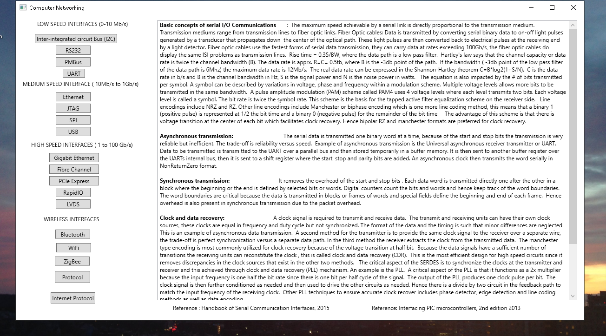
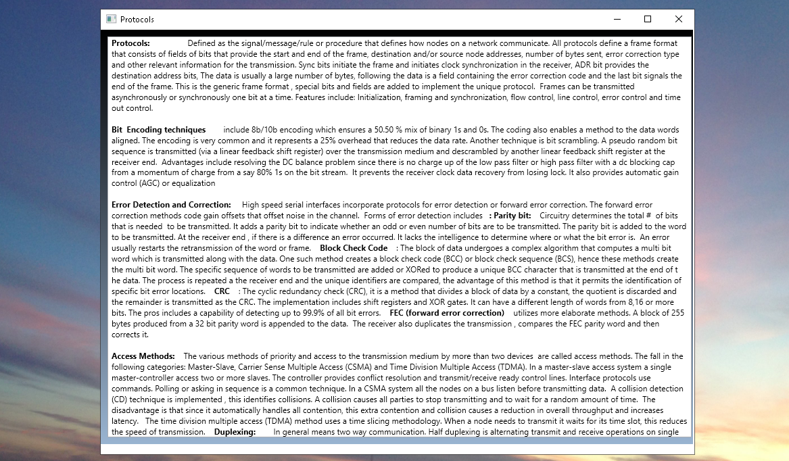
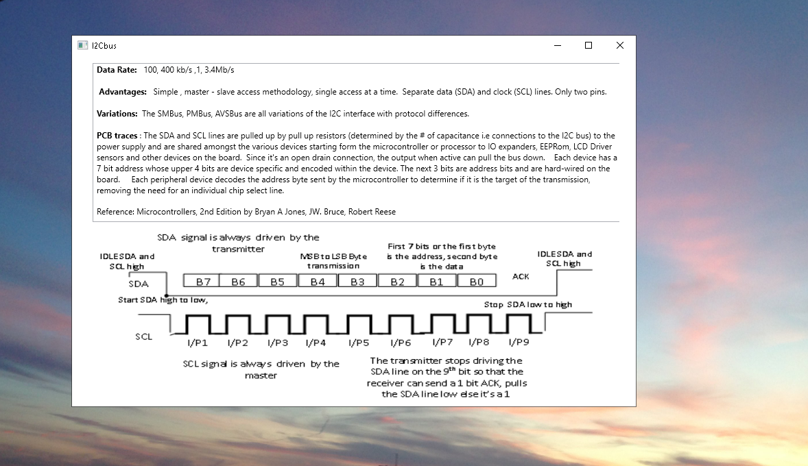
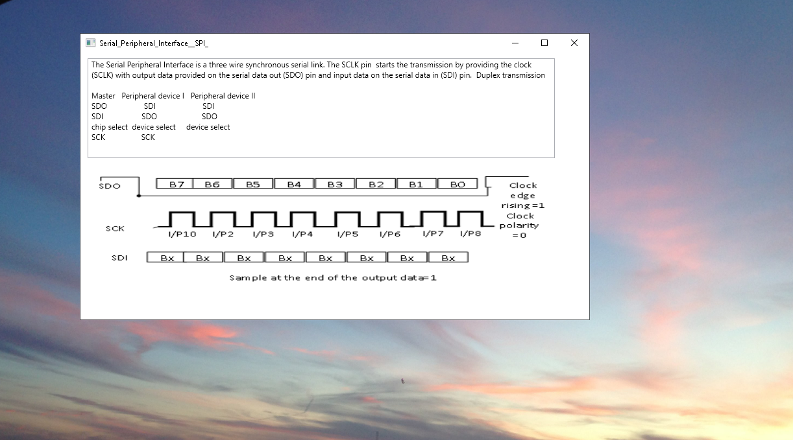
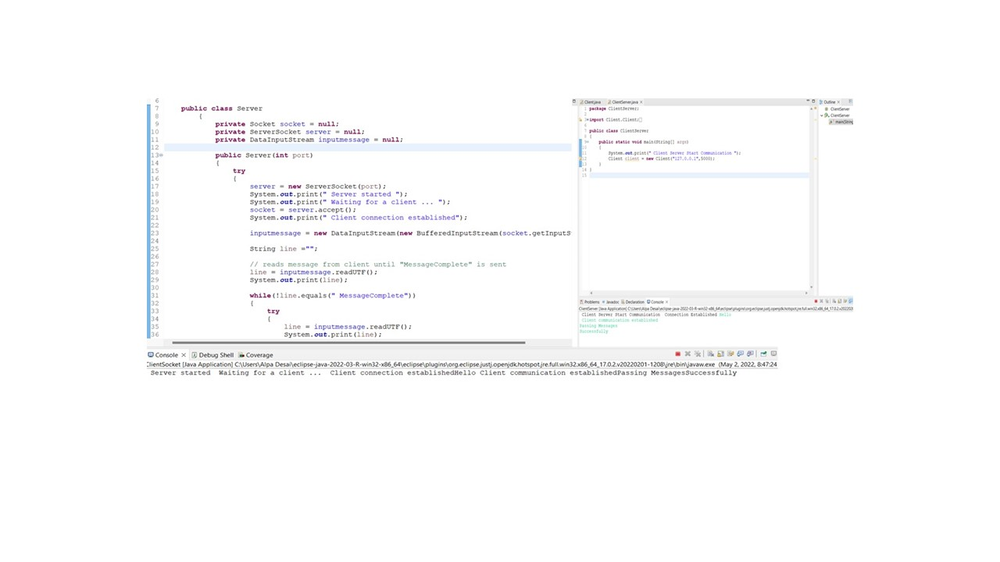
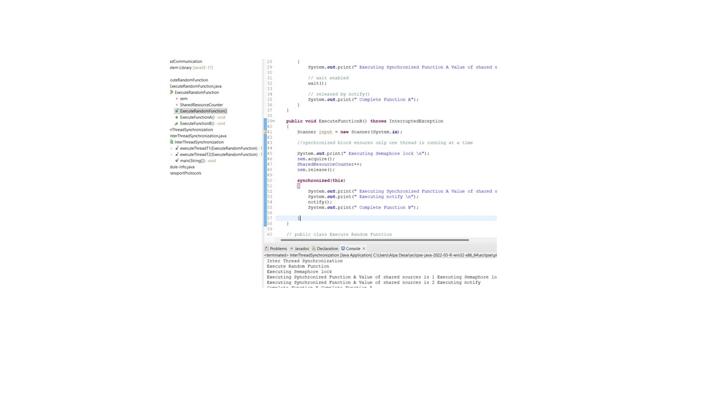

# Computer Networking

The project consists of an analysis and description of the various serial I/O communication interfaces.For details please click on the 
executable on https://github.com/alpaddesai/Computer-Networking/releases. Company confidential information is not displayed. All images are 
either custom by Alpa D Desai or a reference name is included.

## Serial I/O Communication Interfaces

## Protocols

## Ethernet

## Microcontroller serial interface I2C bus

## Microcontroller serial interface SPI bus

## CLient Server communication

## Synchronization

Additional details : https://github.com/alpaddesai/EmbeddedProgramming
